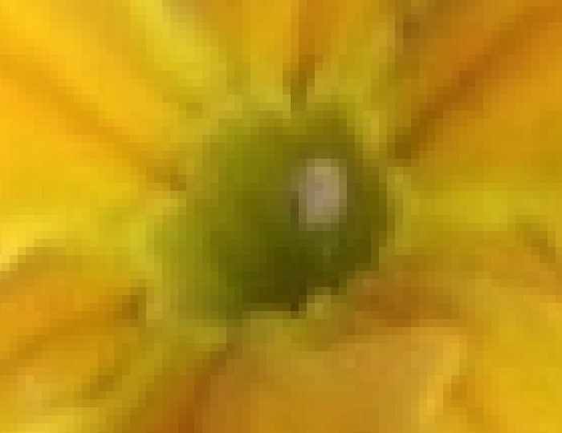

You can now save images as a spreadsheet. Continue reading the post to know how.

# Intro
We usually store images in traditional formats like jpeg, png, etc. and then import them into the spreadsheet but why not turn the spreadsheet itself into an image?

# Behind the screen:
ACT 1:

Modern days digital images are usually stored as a series of pixels which are filled with combination of Red, Blue and Green. This arrangement when looked at from a distance is interpreted as image by our eyes.

Take this flower for example

This is the same picture zoomed in:

ACT 2:

Spreadsheets have option to format the cells with a specific background color this can be achieved by setting an RGB value or picking the color from the color palette.

You know where this is going...

# Under the hood:

Basic premise of the application is to take an image as input and format a spreadsheet such that it shows the image when the sheet is zoomed out.

It takes name of the image as command line argument and  processes it in pillow and skimage frameworks. pygame module is used to help user resize the image. xlsxwriter module is used to format the spreadsheet.

# On the screen:

## How to run this application locally:
**Requirements:**  Python should be installed in your local machine.

**Steps to run:**
* Clone the [git repository](https://github.com/Quantumofcosmos/ransom_note_generator) to your local file system.
* Open terminal inside the project folder.
* run command `pip install requirements.txt`
* After the requirements are installed run `python excel_pixel_art.py <image file name>` If an image file is not supplied as argument, default image of Taj mahal will be selected.
* After a dialog to resize the image appears click on Top-left of your region of interest and click on Bottom-right. **Click and drag is currently not working. It will recognize two separate clicks**
* Wait for the processing to complete and *voilà!* you have your formatted file ready in the same directory. 

## Demo:
You will see the following screen on accessing the above URL. Give the text you want in your letter as input and submit to get the adjacent image refreshed with the text that you entered.

The image can be downloaded by right clicking on it. The dimensions of the image are that of an A4 sized paper.

## Features Implemented:
* Randomized
  * Background color
  * Font size(Between 22 and 32)
  * Alphabet rotation
  * Font styles(currently selection between Comic, Comic Bold, FreeSans, Times New Roman, Trebuchet Bold, Vera MoBI and Verdana Italic, Can be extended to more fonts)

## Features ToDo:
* Add a download image button(can be downloaded with right click menu as of now)
* Extensible font styles
* Play with alphabet case
* Word wrapping(Current line break is based on the space available on page not based on the word being processed)
* Take user inputs to randomize above features.
* (May be) Non stranded shaped for alphabet background
* (May be) Live loading of image(Currently reloads after you submit)
* (May be) randomize font color which is currently fixed to black.

You can find the Github Repo **[here](https://github.com/Quantumofcosmos/ransom_note_generator)**
